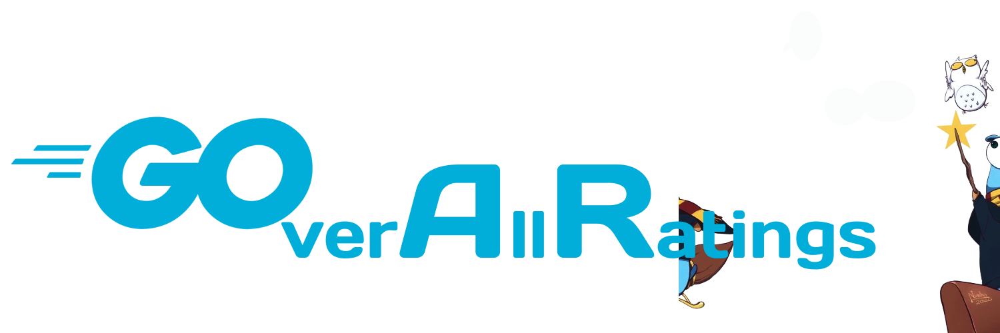

# GOverAllRatings API

<p align="center">
  
</p>

This project is a modern entertainment media rating API built using Golang, designed to evaluate various forms of entertainment such as movies, TV shows, and books. The API is powered by Go-Gin as a router, GoORM for database communication, SQLite as the database, and Swagger for API documentation and testing. The project follows a modern package structure to keep the codebase organized and maintainable.

---

## Features

- Using Go-Gin as a router for route management
- Implementing SQLite as the database for the API
- Using GoORM for communication with the database
- Integrating Swagger for API documentation and testing [🚧WIP]
- Creating a modern package structure for organizing the project
- Implementing a complete movie and tv shows rating API with endpoints for searching, creating, editing, and deleting movies and tv shows
- Implementing automated tests to ensure API quality [🚧WIP]

## Installation

To use this project, you need to follow these steps:

1. Clone the repository: `git clone https://github.com/viniciusdsouza/goverallratings.git`
2. Install the dependencies: `go mod download`
3. Build the application: `go build`
4. Run the application: `./main`

## Makefile Commands

The project includes a Makefile to help you manage common tasks more easily. Here's a list of the available commands and a brief description of what they do:

- `make run`: Run the application without generating API documentation.
- `make run-with-docs`: Generate the API documentation using Swag, then run the application.
- `make build`: Build the application and create an executable file named `goverallratings`.
- `make test`: Run tests for all packages in the project.
- `make docs`: Generate the API documentation using Swag.
- `make clean`: Remove the `goverallratings` executable and delete the `./docs` directory.

To use these commands, simply type `make` followed by the desired command in your terminal. For example:

```sh
make run
```

## Used Tools

This project uses the following tools:

- [Golang](https://golang.org/) for backend development
- [Go-Gin](https://github.com/gin-gonic/gin) for route management
- [GoORM](https://gorm.io/) for database communication
- [SQLite](https://www.sqlite.org/index.html) as the database
- [Swagger](https://swagger.io/) for API documentation and testing

## Usage

After the API is running, you can use the Swagger UI to interact with the endpoints for searching, creating, editing, and deleting movies and shows. The API can be accessed at `http://localhost:$PORT/swagger/index.html`.

Default $PORT if not provided=8080.
